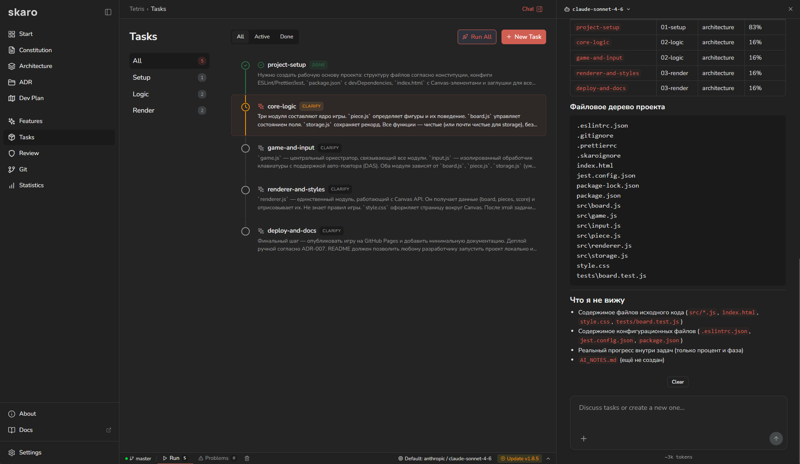

<p>
  
Image credit: NASA
</p>


<br />

<div align="center">

<picture>
  
</picture>

# Skaro
### The open-source spec-driven workspace<br /> for software development with AI


[Website](https://skaro.dev) · [Documentation](https://docs.skaro.dev) · [PyPI](https://pypi.org/project/skaro/) · [Telegram](https://t.me/skarodev) · [Discord](https://discord.gg/zUv6AHuJwD)





</div>

## What is Skaro?

---
Skaro is positioned as a tool where the developer remains the architect and the AI acts as 
the executor: the platform supports architecture reviews, ADRs, DevPlans, step-by-step task execution,
Git integration, model usage analytics, and stack-specific instruction sets for different technologies. 
That makes Skaro a practical orchestration layer for AI-assisted software development, 
especially in projects where reproducibility, consistency, and quality control matter.

## Features

---
- Project artifacts live next to the code — constitution, architecture, ADRs, development plans, and task specs are stored in .skaro/ inside the repository, so project context stays versioned with the codebase.
- Fast onboarding for existing repositories — Skaro can analyze an existing codebase and generate initial artifacts such as constitution, architecture, and an inventory of already implemented functionality.
- Engineering rules are explicit — project conventions, stack constraints, and architectural decisions are captured as real artifacts, so AI works within defined boundaries instead of relying on ad hoc prompting.
- Ideas become executable plans — Skaro turns features and changes into milestones and tasks, making the implementation path explicit instead of leaving it scattered across chats.
- Tasks move through a fixed workflow — each task follows clarify → plan → implement → tests, helping teams avoid jumping straight into code generation without alignment and structure.
- AI works with repository-aware context — Skaro selects relevant files and combines them with project structure, so the model gets focused context for the current step instead of the entire codebase at once.
- Completion is verified, not assumed — tasks can include structural checks, test commands, and recorded validation results, so “done” means reviewed and verified.
- Project-wide review is built in — beyond task-level execution, Skaro can validate project artifacts, task states, and verification steps across the whole repository.
- Git stays part of the workflow — diffs, staging, commits, and branch operations are integrated into the process, keeping implementation flow tied to the actual repository state.
- AI behavior is configurable for the stack — models, providers, skills, and stack-specific instruction sets make it possible to adapt AI execution to the technology and engineering style of the project.
- LLM usage is visible — usage statistics show token consumption by role, phase, task, and model, making AI cost and workflow patterns easier to understand.

## Install

---
Python 3.11+ required. Everything included: CLI, web dashboard, LLM adapters, templates.

**Linux / macOS:**

```sh
curl -fsSL https://raw.githubusercontent.com/skarodev/skaro/main/install.sh | sh
```

**Windows (PowerShell):**

```powershell
irm https://raw.githubusercontent.com/skarodev/skaro/main/install.ps1 | iex
```

**Alternative (if you have pipx or uv):**

```
pipx install skaro
# or
uv tool install skaro
```

## Quick start

---

```
cd my-project
skaro init
skaro ui
```

`skaro init` creates a `.skaro/` directory with constitution, architecture template, and config.

`skaro ui` starts the web dashboard at `http://localhost:4700`. LLM provider is configured from the UI.

## Update

---

Check for a new version:

```
skaro update
```

Use `--force` to bypass the 24-hour cache:

```
skaro update --force
```

**Upgrade — install script (venv):**

| OS | Command |
|---|---|
| Windows | `& "$env:USERPROFILE\.skaro\venv\Scripts\pip.exe" install --upgrade skaro` |
| macOS / Linux | `~/.skaro/venv/bin/pip install --upgrade skaro` |

Or simply re-run the install script — it detects the existing venv and upgrades in place.

**Upgrade — pipx:**

```
pipx upgrade skaro
```

Verify after upgrade:

```
skaro --version
```

## From source (development)

```
git clone https://github.com/skarodev/skaro.git
cd skaro
python3 -m venv .venv && source .venv/bin/activate  # Windows: .venv\Scripts\activate
pip install -e ".[dev]"
```

Frontend (requires Node.js 18+):

```
cd frontend
npm install
npm run build
```

Run tests:

```
pytest
```

## License

---

AGPL-3.0 — see [LICENSE](LICENSE).

---

From Russia with love ❤️

